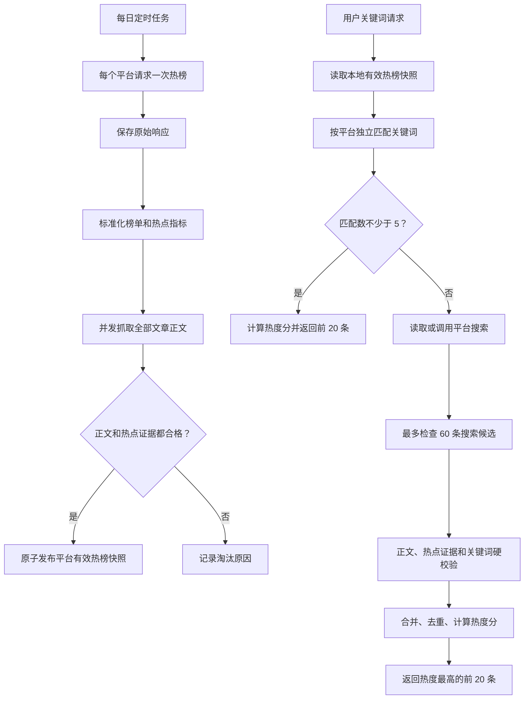

# 新浪、澎湃、网易热点数据源设计

## 1. 目标

在现有 `V4` 头条工作流的基础上，新增新浪新闻、澎湃新闻和网易新闻三个匿名数据源，并统一为“每日热榜预采集、用户请求时按需搜索补足”的两阶段流程。

最终结果必须同时满足：

1. 文章与用户关键词匹配。
2. 文章具有完整正文，不允许降级为摘要或标题。
3. 文章具有可验证的热点证据，包括官方热榜身份或公开的阅读、评论、点赞、分享、收藏、平台原生热度等数值。
4. 每个平台独立处理，期望至少返回 5 条，最多返回 20 条。
5. 不依赖长期 Cookie 保活。

腾讯新闻暂不在第一批范围内。腾讯热榜和正文可匿名获取，但当前没有确认到稳定、匿名的原生关键词搜索接口，无法完成完整的搜索补足闭环。

## 2. 非目标

- 不在本阶段实现跨平台去重。
- 不在 provider 内进行跨平台排序。
- 不使用登录 Cookie、用户会话或验证码绕过方案。
- 不把搜索位置、搜索结果数量或发布时间本身解释为热点数据。
- 不使用摘要、标题或生成内容代替文章正文。
- 不保证每个平台强制返回 5 条；合格数据不足时按实际数量返回。

## 3. 总体架构

系统拆分为每日采集阶段和用户请求阶段。



### 3.1 每日采集阶段

每个平台每天只请求一次官方热榜。用户请求不再触发热榜请求。

采集步骤：

1. 请求平台官方热榜。
2. 立即保存未经处理的原始响应。
3. 标准化文章 ID、URL、标题、发布时间、榜单名次和全部公开热点指标。
4. 仅为文章类型记录抓取正文。
5. 执行正文完整性检查和热点证据检查。
6. 合格记录写入 `eligible` 快照，不合格记录及原因写入 `rejected`。
7. 本轮平台采集完整结束后，原子更新该平台的 active snapshot。

三个平台独立采集、独立发布，一个平台失败不影响其他平台。

### 3.2 用户请求阶段

每个平台独立执行以下流程：

```python
MIN_RESULTS = 5
MAX_RESULTS = 20
SEARCH_PAGE_SIZE = 15
MAX_SEARCH_CANDIDATES = 60

hot_matches = match_keyword(valid_cached_hot_items, keyword)

if len(hot_matches) >= MIN_RESULTS:
    return rank_by_heat(hot_matches)[:MAX_RESULTS]

search_candidates = search_until_limit(
    keyword=keyword,
    page_size=SEARCH_PAGE_SIZE,
    candidate_limit=MAX_SEARCH_CANDIDATES,
)
qualified_search = validate_search_candidates(search_candidates)
merged = deduplicate_within_platform(hot_matches + qualified_search)
return rank_by_heat(merged)[:MAX_RESULTS]
```

语义约束：

- 5 条阈值按平台独立计算。
- 热榜匹配达到 5 条后，该平台不调用搜索。
- 热榜匹配少于 5 条时，调用搜索并尽可能扩充最终候选池。
- 搜索每批期望获取 15 条候选，最多检查 60 条平台内去重候选。
- 搜索过程中可以在获得 20 条合格结果后停止继续翻页和抓正文。
- 搜索候选无正文或无热点证据时必须淘汰。
- 最终结果统一按平台热度分排序，不使用搜索返回顺序或官方榜单顺序直接截断。

## 4. 正文硬门槛

正式结果仅接受 `content_status="full_text"`。

正文按“平台结构化数据、平台正文 DOM、GNE 兜底”的顺序提取。GNE 仅是解析器兜底，不是质量降级；其输出仍需通过相同的正文验证。

默认正文质量要求按解析来源分级：

- 平台结构化正文或明确正文容器清洗后不少于 80 个有效字符。
- GNE 等通用兜底解析结果清洗后不少于 200 个有效字符。
- 至少包含 2 个正文段落或 3 个完整句子。
- 正文不能等于标题或摘要。
- 拒绝登录提示、付费提示、相关推荐、评论区、导航、页脚和重复模板。
- 拒绝视频、短视频、图集、直播、播客、专题和无法取得完整原文的外链。
- 发现明显截断、占位、重复页面框架或正文容器为空时拒绝。

正文门槛允许按平台提高，但不得降低到摘要或标题。正文完整性由解析
来源、结构和内容共同判断，不以单一的 200 字阈值误伤完整新闻简讯。

## 5. 热点证据与排序

### 5.1 热点资格

文章满足以下任一条件才具有热点资格：

1. 文章属于当天平台官方热榜；或者
2. 搜索文章的至少一个可比互动指标达到当天有效热榜同名指标的动态门槛。

动态门槛默认取当天有效热榜中该指标正数样本的第 25 百分位。正数样本不足时使用平台配置的绝对兜底值。缺少可比指标、指标接口失败或指标无法映射时，搜索文章必须淘汰。

官方榜单身份是热点证据，但榜单名次只作为排序输入或并列条件，不直接决定最终顺序。

### 5.2 指标归一化

阅读、评论和点赞的数量级不同，不能直接相加。

每个平台在最终候选池内对每个指标执行：

1. 将原始值转换为非负数。
2. 使用 `log1p(value)` 降低极端头部值影响。
3. 计算平台内百分位，得到 `0..1` 的标准化值。
4. 按平台权重计算 `platform_heat_score`。

缺失指标按零处理，不重新分摊其权重，避免只有单个指标的文章被放大。

### 5.3 稳定排序

排序键依次为：

1. `platform_heat_score` 降序。
2. 有效热点指标数量降序。
3. 官方热榜身份优先。
4. 官方榜单名次升序。
5. 发布时间降序。
6. 规范化文章 ID 升序。

官方热榜匹配和搜索合格结果进入同一候选池统一排序。

## 6. 新浪新闻 Provider

### 6.1 热榜

接口：

```text
https://top.news.sina.com.cn/ws/GetTopDataList.php?js_var=data&top_cat=www_www_all_suda_suda&top_channel=news&top_order=DESC&top_show_num=50&top_time=today&top_type=day
```

关键字段：

- `title`
- `url`
- `top_num`
- `commentid`
- `create_date`
- `media`
- 返回顺序生成的官方 `rank`

响应为 JSONP，需要严格剥离外层变量赋值并验证 `data` 为非空列表。

`top_num` 作为新浪主要浏览/传播热度指标。若 `commentid` 可映射，则额外查询公开评论总数，为热榜和搜索候选建立可比评论基线。

### 6.2 正文

按顺序尝试：

1. `#artibody`
2. `#article`
3. `.article-content`
4. `#article-content`
5. `.article-content-left`
6. `.main-content`
7. GNE

所有结果必须经过统一正文硬门槛。

### 6.3 搜索

接口：

```text
GET https://search.sina.com.cn/api/news?q=<keyword>&page=<page>
```

搜索结果可提供标题、简介、媒体、时间和 URL，但不直接提供可靠阅读量。

搜索候选处理：

1. 标题、简介和正文执行规范化关键词匹配。
2. 从 URL 或页面元数据提取 `channel` 和 `newsid`。
3. 查询新浪公开评论数据。
4. 与当天新浪有效热榜评论基线比较。
5. 评论指标达到动态门槛或 URL 与官方热榜重合时保留。
6. 无法取得评论指标且不在官方热榜时淘汰。

### 6.4 热度分

```text
top_num 百分位      70%
评论量百分位         30%
```

搜索文章通常缺少 `top_num`，缺失部分按零处理。

## 7. 澎湃新闻 Provider

### 7.1 热榜

接口：

```text
GET https://cache.thepaper.cn/contentapi/wwwIndex/rightSidebar
```

关键字段：

- `contId`
- `name`
- `interactionNum`
- `praiseTimes`
- `contType`
- `pubTimeLong`
- `paywalled`
- 返回顺序生成的官方 `rank`

仅保留：

- `contType == 0`
- `paywalled == false`
- 非视频、图集、直播、播客和外链占位内容

### 7.2 正文

文章地址：

```text
https://www.thepaper.cn/newsDetail_forward_<contId>
```

按顺序尝试：

1. `script#__NEXT_DATA__`
2. `props.pageProps.detailData.contentDetail.content`
3. 页面正文 DOM
4. GNE

所有结果必须经过统一正文硬门槛。

### 7.3 搜索

接口：

```http
POST https://api.thepaper.cn/search/web/news
Client-Type: 1
Content-Type: application/json
```

请求体：

```json
{
  "word": "用户关键词",
  "orderType": 3,
  "pageNum": 1,
  "pageSize": 15,
  "searchType": 1
}
```

搜索结果直接带有 `interactionNum`、`praiseTimes`、`contId`、`contType`、`paywalled`、`summary` 和 `pubTimeLong`。

搜索候选必须：

- 满足文章类型和非付费约束。
- 关键词匹配。
- 正文合格。
- `interactionNum` 或 `praiseTimes` 至少一项达到当天热榜同名指标动态门槛，或与官方热榜重合。

### 7.4 热度分

```text
interactionNum 百分位   60%
praiseTimes 百分位      40%
```

## 8. 网易新闻 Provider

### 8.1 热榜

正式热榜接口：

```text
GET https://gw.m.163.com/nc-main/api/v1/hqc/no-repeat-hot-list
```

不得使用缺少热度字段的弱接口作为正式来源：

```text
https://m.163.com/fe/api/hot/news/flow
```

关键字段：

- `contentId`
- `title`
- `type`
- `hotValue`
- `click`
- `commentCount`
- `votecount`
- `threadVote`
- `ptcount`
- `clickRatio`
- `ptime`
- `source`
- 返回顺序生成的官方 `rank`

仅保留 `type == "doc"` 的普通文章。

### 8.2 正文

文章 URL 使用 `contentId` 生成或使用来源 URL。

按顺序尝试：

1. `.post_body`
2. 网易历史正文容器
3. 页面内结构化文章字段
4. GNE

拒绝视频、短视频、图集、专题、直播和正文不完整的页面。

### 8.3 搜索

匿名 PC 搜索页：

```text
GET https://www.163.com/search?keyword=<keyword>
```

当前服务端页面可返回约 50 条结果，包括：

- `docid`
- `title`
- `url`
- `source`
- `publication_time`
- `comment_count`

搜索候选处理：

1. 解析服务端 HTML，不依赖浏览器或 Cookie。
2. 规范化并去重文章 ID 和 URL。
3. 执行关键词初筛。
4. 抓取并验证完整正文。
5. 使用搜索页或评论接口取得 `commentCount`。
6. 评论量达到当天网易有效热榜动态门槛，或与官方热榜重合时保留。

若评论正数样本不足，使用配置化绝对门槛，初始建议值为 `commentCount >= 10`，并在真实数据 smoke test 后校准。

### 8.4 热度分

```text
hotValue 百分位       40%
click 百分位          30%
commentCount 百分位   15%
votecount 百分位      10%
threadVote 百分位      5%
```

搜索文章缺失的指标按零处理。

## 9. 平台内去重

每个平台按以下顺序识别重复文章：

1. 平台稳定文章 ID。
2. 规范化 canonical URL。
3. Unicode NFKC、大小写折叠、去空白和标点后的完整标题。

重复记录合并时：

- 保留更完整的正文。
- 各热点指标取同名字段最大值。
- 保留官方热榜证据。
- 保留最早的官方榜单名次。
- 来源 URL 优先使用平台 canonical URL。

跨平台重复文章在后续聚合层处理，不属于本设计范围。

## 10. 数据契约

现有 `HeatMetrics` 继续保留，但需要增加明确的热点证据和资格状态。

建议新增：

```python
@dataclass(frozen=True)
class HeatEvidence:
    source_kind: Literal["official_hot_board", "public_engagement"]
    platform_rank: int | None
    native_hot_value: float | None
    metrics: Mapping[str, float]
    threshold_metrics: Mapping[str, float]
    qualified_by: tuple[str, ...]


@dataclass(frozen=True)
class ContentValidation:
    status: Literal["accepted", "rejected"]
    parser: str
    character_count: int
    paragraph_count: int
    reasons: tuple[str, ...]


@dataclass(frozen=True)
class QualifiedArticle:
    hot_item: HotItem
    detail: ItemDetail
    heat_evidence: HeatEvidence
    content_validation: ContentValidation
    platform_heat_score: float
```

正式推荐结果只允许由 `QualifiedArticle` 转换产生，不能直接从 `HotItem` 或摘要构造。

provider 统一能力：

```python
class NewsProvider(Protocol):
    platform: str

    def collect_hot_list(self, collected_at: str) -> ProviderCapture: ...
    def fetch_detail(self, item: HotItem, collected_at: str) -> ItemDetail: ...
    def search(
        self,
        keyword: str,
        page: int,
        page_size: int,
        collected_at: str,
    ) -> ProviderCapture: ...
    def enrich_metrics(
        self,
        items: Sequence[HotItem],
        collected_at: str,
    ) -> tuple[HotItem, ...]: ...
```

## 11. 存储与缓存

### 11.1 每日热榜

```text
data/daily_hot_lists/<business-date>/
├── raw/<platform>.json
├── normalized/<platform>.json
├── eligible/<platform>.json
├── rejected/<platform>.json
├── details/<platform>_<item_id>.txt
└── collection_status.json
```

`normalized` 保存所有合法解析记录，`eligible` 只保存正文和热点证据均合格的记录，`rejected` 保存可诊断的淘汰原因。

### 11.2 搜索缓存

```text
data/search_cache/<business-date>/<platform>/<keyword_hash>/
├── raw/page_<page>.<suffix>
├── normalized.json
├── eligible.json
├── rejected.json
├── details/<item_id>.txt
└── status.json
```

缓存键：

```text
business_date + platform + normalized_keyword
```

规则：

- 同一天、同平台、同一规范化关键词只执行一次成功搜索。
- 明确空结果可缓存到当天结束。
- 网络或解析失败不能缓存为正常空结果。
- 临时失败仅做 5 至 15 分钟负缓存。
- 原始关键词不用于文件名，避免路径问题和不必要的信息暴露。

## 12. 失败与陈旧快照

- 平台热榜失败不影响其他平台。
- 正文单条失败只淘汰该文章。
- 搜索失败保留已匹配的缓存热榜结果。
- 热榜匹配少于 5 且搜索失败时，按实际热榜匹配数量返回，并记录 `search_status`。
- 任何失败都不得产生摘要或标题形式的正式结果。
- active snapshot 只在平台采集完整结束后原子切换。

若当天采集失败，可以使用该平台最近一次成功快照：

- 默认最大陈旧时间为 48 小时。
- 返回 `snapshot_date` 和 `is_stale=true`。
- 超过最大陈旧时间后平台状态为 `not_ready`。

陈旧快照仅降低时效性，不降低正文或热点证据标准。

## 13. 从 V4 迁移

需要修正现有头条 V4 的以下语义：

1. `generate_v1_user_result()` 当前总是调用搜索，改为平台热榜匹配少于 5 条才搜索。
2. `_collect_details()` 当前会将摘要或标题保存为可用详情，新流程改为 rejected。
3. 正式推荐结果不再接受 `summary` 和 `title_only`。
4. 搜索排名不再作为热点证据。
5. 无官方热点证据的 Level 3 搜索结果不进入正式结果。
6. `V1_PLATFORMS` 硬编码改为 provider registry。
7. 官方热榜和搜索结果统一按平台热度分排序。
8. 详情文件名由序号改为稳定文章 ID，避免榜单顺序变化导致缓存错配。

头条 provider 可以在后续迁移到相同协议，但不属于本次三个新 provider 的交付范围。

## 14. 开源项目复用

### 14.1 DailyHotApi

[DailyHotApi](https://github.com/imsyy/DailyHotApi) 可参考新浪、澎湃和网易路由的请求方式与基础字段映射。

不能直接照搬：

- 不负责正文完整性。
- 会丢失部分互动指标。
- 网易当前适配器使用弱接口并将 `hot` 设为 `undefined`。
- 不包含本设计的搜索补足、动态门槛和统一热度排序。

### 14.2 GeneralNewsExtractor

[GeneralNewsExtractor](https://github.com/GeneralNewsExtractor/GeneralNewsExtractor) 可作为正文解析兜底。其 [PyPI 包](https://pypi.org/project/gne/) 可直接用于 Python 项目。

GNE 输出必须继续通过平台统一正文验证，不能因解析器返回非空文本就直接认定为完整正文。

## 15. Demo 阶段

Demo 阶段交付：

1. 三个平台每日匿名热榜采集。
2. 原始、标准化、有效、淘汰和正文文件落盘。
3. 每个平台独立关键词匹配。
4. 少于 5 条时的匿名搜索补足。
5. 最多 60 条搜索候选、最多 20 条最终结果。
6. 正文与热点证据硬门槛。
7. 平台内去重和热度排序。
8. 固定样例测试与一次真实匿名 smoke test。

Demo 阶段使用配置文件保存指标权重、绝对门槛、正文最小长度和最大陈旧时间，方便真实数据校准。

## 16. 长期稳定阶段

长期稳定阶段增加：

- 定时调度和错峰采集。
- 指标分布监控与动态门槛漂移告警。
- 接口 schema 变化告警。
- 正文成功率、淘汰原因和搜索补足率监控。
- 搜索缓存清理和数据保留策略。
- 多日热度衰减。
- 跨平台事件聚类与去重。
- 腾讯等后续 provider 接入。
- provider 契约测试和每日真实端点 canary。

## 17. 验收标准

设计实现完成的最低验收标准：

1. 三个平台热榜均可在无 Cookie、无登录状态下采集。
2. 每个平台原始响应只在每日任务中请求一次并缓存。
3. 用户请求不会重新请求热榜。
4. 每个正式返回结果都具有完整正文。
5. 每个正式返回结果都具有官方热榜或公开互动数据证据。
6. 热榜匹配达到 5 条时不调用搜索。
7. 少于 5 条时搜索最多检查 60 条候选。
8. 最终结果不超过 20 条。
9. 最终顺序由平台热度分决定，不由搜索顺序或官方顺序直接决定。
10. 搜索、正文或指标失败不会生成摘要和标题降级结果。
11. 同日相同平台和关键词复用搜索缓存。
12. 自动化测试覆盖解析、过滤、门槛、排序、缓存、失败隔离和陈旧快照。

## 18. 公开来源

- [DailyHotApi](https://github.com/imsyy/DailyHotApi)
- [DailyHotApi 网易新闻路由](https://raw.githubusercontent.com/imsyy/DailyHotApi/master/src/routes/netease-news.ts)
- [GeneralNewsExtractor](https://github.com/GeneralNewsExtractor/GeneralNewsExtractor)
- [GNE PyPI](https://pypi.org/project/gne/)
- [新浪新闻热榜接口](https://top.news.sina.com.cn/ws/GetTopDataList.php?js_var=data&top_cat=www_www_all_suda_suda&top_channel=news&top_order=DESC&top_show_num=50&top_time=today&top_type=day)
- [新浪新闻搜索接口](https://search.sina.com.cn/api/news?q=%E4%BA%BA%E5%B7%A5%E6%99%BA%E8%83%BD&page=1)
- [澎湃新闻热榜接口](https://cache.thepaper.cn/contentapi/wwwIndex/rightSidebar)
- [网易新闻正式热榜接口](https://gw.m.163.com/nc-main/api/v1/hqc/no-repeat-hot-list)
- [网易新闻搜索页](https://www.163.com/search?keyword=%E4%BA%BA%E5%B7%A5%E6%99%BA%E8%83%BD)
