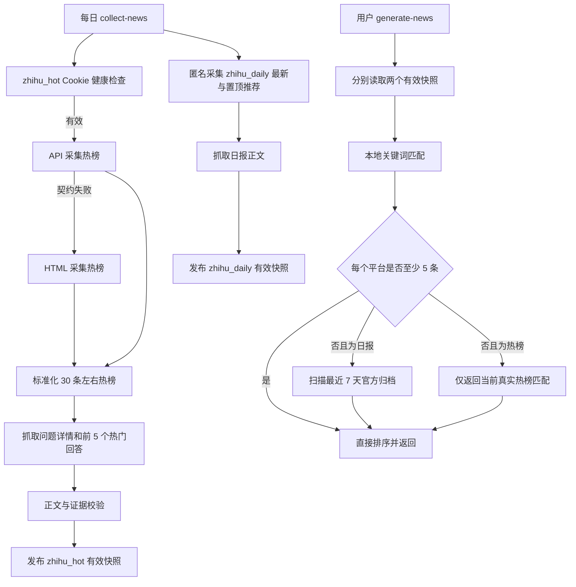

# 知乎站内热榜与知乎日报双数据源设计

## 1. 目标

在现有 cached-news 工作流中同时提供两个相互独立的知乎数据源：

- `zhihu_hot`：采集知乎站内真实热榜、问题信息和热门回答，需要本地维护 `ZHIHU_COOKIE`。
- `zhihu_daily`：继续采集知乎日报最新推荐、置顶推荐、正文和最近 7 天官方归档，保持匿名访问。

两个数据源都输出可追溯、可缓存、可用于用户热点匹配的完整内容。任一数据源失败不能阻断另一数据源，也不能阻断其他平台。

## 2. 已验证的现实约束

2026-07-25 的真实访问验证结果如下：

- 匿名请求 `https://www.zhihu.com/hot` 返回 `403`。
- 匿名请求 `https://www.zhihu.com/api/v3/feed/topstory/hot-lists/total?limit=50&desktop=true` 返回 `401`。
- 已登录页面 `https://www.zhihu.com/hot` 返回 30 条真实热榜，页面可见排名、问题标题、问题描述、问题 URL 和“万热度”。
- 已登录问题页可见问题浏览量、关注数、回答数、热门回答正文、作者、赞同数、评论数和发布时间。
- `https://daily.zhihu.com/api/4/news/latest` 可匿名访问；2026-07-25 的实时响应包含 4 条普通推荐和 5 条置顶推荐。

因此，`zhihu_hot` 必须有明确的本地认证边界；`zhihu_daily` 不应被迫共享 Cookie 或登录状态。

## 3. 方案选择

### 3.1 选定方案：Cookie HTTP + API/HTML 双解析

`zhihu_hot` 使用普通 `httpx` 请求和本地 `ZHIHU_COOKIE`。热榜采集先尝试结构化 API，再使用 `/hot` HTML 解析作为兼容路径。问题详情和热门回答同样优先使用结构化响应，在契约不满足时使用已登录问题页 HTML。

选择该方案的原因：

- 可直接接入现有定时采集和 CLI，不需要常驻浏览器。
- 结构化 API 便于稳定解析，HTML 兼容路径降低单一路径变更风险。
- Cookie 替换不需要改代码或重新部署。
- 能沿用现有缓存、失败隔离、正文验证和凭据扫描。

### 3.2 未选方案

#### Playwright 登录浏览器

浏览器方式接近人工访问，但资源开销和运行环境要求更高，难以作为默认后台定时任务。它只用于人工诊断和真实 smoke 验证，不进入生产采集路径。

#### 第三方热榜聚合服务

第三方服务可能提供标题和排名，但无法保证问题描述、热度、回答正文及证据完整性，还会增加运行时依赖。正式流程直接访问知乎原始页面或接口。

## 4. 总体架构



`zhihu_hot` 没有可靠的历史热榜或原生关键词搜索接口。用户匹配不足 5 条时，不得用普通知乎搜索结果冒充热榜，只返回当前有效热榜中的实际匹配。

## 5. 认证与 Cookie 生命周期

### 5.1 配置

本地 `.env` 增加：

```text
ZHIHU_COOKIE=
```

`.env.example` 只保留空值和配置说明。生产代码只接收 Cookie 字符串，不读取浏览器 Cookie、密码、本地存储或其他会话文件。

### 5.2 请求边界

`ZHIHU_COOKIE` 只进入 `ZhihuHotProvider` 创建的知乎请求头。它不得进入：

- `HotItem.raw_payload`
- `ItemDetail`
- `collection_status.json`
- 日志
- 异常消息
- fixture
- smoke 数据
- Git 历史

所有重定向必须限制在受信任的知乎域名内。Cookie 不得发送给外链文章、图片、广告或其他域名。

### 5.3 健康状态

以下情况统一转换为 `AuthenticationExpiredError("ZHIHU_COOKIE")`：

- 缺少或空 Cookie。
- 热榜或详情请求返回 `401`、`403`。
- 最终 URL 进入 `/signin`。
- 页面只包含登录提示而没有热榜或问题主体。

新增健康检查能力，执行一次轻量热榜请求并返回：

```text
valid
missing
expired
blocked
contract_changed
```

健康检查不得输出 Cookie 值。Cookie 失效后，用户只需更新本地 `.env` 并重新运行采集。

## 6. `zhihu_hot` Provider

### 6.1 Provider 接口

新增：

```python
class ZhihuHotProvider:
    platform = "zhihu_hot"

    def __init__(self, client: httpx.Client, cookie: str): ...
    def check_auth(self) -> str: ...
    def collect_hot_list(self, collected_at: str) -> ProviderCapture: ...
    def fetch_detail(self, item: HotItem, collected_at: str) -> ItemDetail: ...
    def enrich_metrics(
        self,
        items: Sequence[HotItem],
        collected_at: str,
    ) -> tuple[HotItem, ...]: ...
```

`search()` 返回显式空结果，因为普通站内搜索不具备真实热榜证据。

### 6.2 热榜采集

首选端点：

```text
GET https://www.zhihu.com/api/v3/feed/topstory/hot-lists/total?limit=50&desktop=true
```

兼容页面：

```text
GET https://www.zhihu.com/hot
```

采集器接受 1 至 50 条有效记录，正常预期约 30 条。空榜、缺少标题、缺少问题 ID、缺少有效排名或全部记录无热度时失败关闭。

每条记录标准化为：

```text
platform          = "zhihu_hot"
item_id           = "zhihu_hot_question_<question_id>"
title             = 问题标题
summary           = 问题描述或热榜摘要
url               = https://www.zhihu.com/question/<question_id>
rank              = 官方热榜顺序
heat.metric_name  = "hot_score"
heat.value        = 解析后的整数热度
heat.metrics      = {"hot_score": <整数热度>}
raw_payload       = 不含凭据的必要来源字段
```

“2114 万热度”统一解析为 `21_140_000`。展示文本可保留为 `heat.label`，正式排序使用整数值。

### 6.3 API 与 HTML 双解析

API 解析器和 HTML 解析器输出相同的 `HotItem` 契约。

回退顺序：

1. API HTTP 成功且契约有效：使用 API 结果。
2. API 的成功响应发生 schema 变化：请求 `/hot` 并解析 HTML。
3. API 返回 `401`、`403` 或登录跳转：直接报认证失效，不用 HTML 掩盖认证问题。
4. HTML 仍不满足契约：记录 `contract_changed`。

fixture 分别固定 API 和 HTML 契约，测试两者的字段一致性。

### 6.4 问题详情和热门回答

每个热榜问题保存：

- 完整问题描述。
- 关注者数量。
- 浏览量。
- 回答总数。
- 前 5 个默认排序热门回答。

每个热门回答保存：

- `answer_id`
- 作者显示名
- 回答正文
- 赞同数
- 评论数
- 收藏数（页面提供时）
- 喜欢数（页面提供时）
- 发布时间和编辑时间（页面提供时）
- 回答 URL

详情的纯文本格式固定为：

```text
问题描述

热门回答 1
作者：...
赞同：...
评论：...
正文...

热门回答 2
...
```

同时把结构化统计信息保存到不含 Cookie 的详情 metadata，供后续推荐算法使用。回答不足 5 个时保存实际数量；没有任何可用回答但问题描述满足正文门槛时，详情状态为 `partial`，不得伪造回答。

### 6.5 正文校验

问题描述与回答正文分别清洗，拒绝：

- 登录提示和验证码页面。
- 导航、页脚和广告。
- 推荐问题列表。
- 评论区。
- “展开阅读全文”等页面控件文案。
- 只有标题或摘要的重复内容。
- 图片说明代替正文。

合并后的内容至少满足：

- 80 个有效字符；并且
- 至少 2 个真实段落或 3 个完整句子。

单个热门回答太短时跳过该回答，不影响其他回答。问题页整体无法形成合格正文时，该热榜项进入 `rejected`。

### 6.6 热点证据和排序

有效热榜项必须同时具备：

- 正数官方排名。
- 正数官方热度。
- 可验证的问题 URL 和问题 ID。
- 合格问题详情。

排序顺序：

1. `hot_score` 降序。
2. 官方排名升序。
3. 浏览量降序。
4. 问题 ID 稳定排序。

浏览量、关注数、回答数和回答赞同数是补充互动指标，不能替代官方热榜身份。

## 7. `zhihu_daily` Provider

### 7.1 最新推荐和置顶推荐

继续使用：

```text
GET https://daily.zhihu.com/api/4/news/latest
```

现有实现保留 `stories` 中的 `type == 0` 项。此次扩展同时处理 `top_stories`，平台仍为 `zhihu_daily`，并通过 `raw_payload["recommendation_section"]` 区分：

```text
latest
top
```

同一 story 同时出现在两个区域时按 story ID 去重，优先保留 `top` 身份并记录两个来源位置。

### 7.2 正文和归档

正文继续使用：

```text
GET https://daily.zhihu.com/api/4/news/<story_id>
```

最近 7 天归档继续使用：

```text
GET https://daily.zhihu.com/api/4/news/before/YYYYMMDD
```

保留现有规则：

- 最多检查 60 条去重候选。
- 最多返回 20 条合格结果。
- 标题和 hint 先执行 NFKC 预过滤。
- 正文再次确认关键词。
- 不伪造阅读量、点赞量、评论量或综合热度。

### 7.3 排序

日报结果按以下顺序：

1. `top` 置顶推荐优先。
2. 推荐日期降序。
3. 区域内官方顺序升序。
4. 发布时间降序。
5. story ID 稳定排序。

## 8. 存储和缓存

两个平台复用现有目录：

```text
data/daily_hot_lists/<business-date>/
├── raw/zhihu_hot.html-or-json
├── raw/zhihu_daily.json
├── normalized/zhihu_hot.json
├── normalized/zhihu_daily.json
├── eligible/zhihu_hot.json
├── eligible/zhihu_daily.json
├── rejected/zhihu_hot.json
├── rejected/zhihu_daily.json
├── details/
└── collection_status.json
```

详情文件使用稳定 item ID，热榜名次变化不会改变文件身份。

每日成功快照原子发布。当天采集失败时，允许复用不超过 48 小时的最近成功快照，并明确标记 `stale=true` 和原始业务日期。认证失效不能被静默隐藏；即使使用陈旧快照，也必须在状态中保留 `expired`。

## 9. CLI 和配置

保留现有命令：

```text
heated-topics collect-news
heated-topics generate-news
```

新增只读健康检查：

```text
heated-topics check-zhihu-auth
```

输出只包含状态、检查时间和固定错误码，不包含响应正文、请求头或 Cookie。

`NEWS_PLATFORMS` 和 `NEWS_DISPLAY_ORDER` 注册：

```text
zhihu_hot
zhihu_daily
```

两个平台在用户结果中独立计数和排序，不合并为单一“知乎”平台。

## 10. 失败处理

- `zhihu_hot` 认证失败：平台状态为 `failed` 或 `stale`，错误码为 `auth_missing`、`auth_expired` 或 `auth_blocked`。
- API schema 变化但 HTML 可用：状态为 `success_with_fallback`。
- API 和 HTML 都变化：状态为 `failed:contract_changed`。
- 单个问题详情失败：只拒绝该 item。
- 日报 API 失败：只影响 `zhihu_daily`。
- 任一知乎平台失败：不影响其他平台采集和用户结果生成。

所有网络请求使用有限超时、有限重试和明确的知乎域名白名单。不绕过 CAPTCHA，不自动登录，不读取浏览器会话文件。

## 11. 测试

### 11.1 离线测试

`zhihu_hot` fixture 覆盖：

- API 热榜成功。
- HTML 热榜成功。
- 两种解析器字段一致。
- “万热度”整数转换。
- 缺少 Cookie。
- `401`、`403`、登录跳转。
- API schema 变化后的 HTML 回退。
- 空榜和缺少热度失败关闭。
- 问题描述与前 5 个回答解析。
- 回答不足 5 个。
- 短回答跳过。
- 登录页、验证码和页面框架拒绝。
- Cookie 不进入任何序列化结果。

`zhihu_daily` fixture 增加：

- `top_stories` 解析。
- `stories` 与 `top_stories` 去重。
- 置顶优先排序。

### 11.2 工作流测试

- 两个知乎 Provider 独立执行。
- `zhihu_hot` 失败不影响 `zhihu_daily`。
- 用户请求不重新请求站内热榜。
- 日报少于 5 条匹配时才扫描 7 天归档。
- 站内热榜少于 5 条匹配时不调用普通站内搜索。
- 48 小时陈旧快照边界正确。
- 认证失效使用陈旧快照时仍保留失效状态。

### 11.3 真实 smoke test

使用本地 Cookie，真实验证：

1. `check-zhihu-auth` 返回 `valid`。
2. `zhihu_hot` 获得 1 至 50 条记录，正常预期约 30 条。
3. 至少一条热榜获得问题描述和前 5 个热门回答，或在回答不足时获得全部实际回答。
4. 热度、排名、问题 ID 和 URL 均有效。
5. `zhihu_daily` 获得非空的普通推荐或置顶推荐。
6. 至少一条日报正文通过完整性校验。
7. 运行用户匹配并验证两个平台独立输出。
8. 扫描 smoke 目录，确认没有 Cookie、Authorization 或会话标识。

真实正文和 Cookie 只存在 Git 忽略的临时目录，不提交到仓库。

## 12. Demo 阶段

Demo 完成以下能力：

- `zhihu_hot` API/HTML 双解析。
- Cookie 健康检查和明确失效诊断。
- 真实热榜、问题描述和前 5 个热门回答采集。
- `zhihu_daily` 最新、置顶、正文和 7 天归档。
- 两个平台接入现有采集、缓存和用户结果流程。
- 完整离线测试和一次真实 smoke 验证。

## 13. 长期稳定阶段

长期阶段再增加：

- Cookie 到期提前提醒，而不是仅在采集失败后告警。
- 解析器指标监控，包括热榜条数、回退率、详情成功率和平均回答数。
- 连续多日契约漂移报警。
- 受控的请求节流、抖动和失败退避配置。
- 回答增量刷新，只更新变化的问题详情。
- 在积累用户行为数据后，把回答互动指标接入推荐排序特征。

长期阶段不改变以下边界：不自动登录、不绕过 CAPTCHA、不把普通搜索结果冒充真实热榜、不泄漏 Cookie。

## 14. 验收标准

实现完成必须同时满足：

1. 本地有效 `ZHIHU_COOKIE` 可以通过健康检查。
2. 真实站内热榜产生非空合格快照，正常情况下约 30 条。
3. 热榜记录包含排名、整数热度、问题 ID、标题、描述和来源 URL。
4. 至少一个真实问题详情包含合格问题描述及最多 5 个热门回答。
5. 热门回答包含正文和可获得的作者、赞同、评论、发布时间信息。
6. 知乎日报匿名采集最新与置顶推荐并获取合格正文。
7. 日报最近 7 天归档发现流程保留 60 候选和 20 结果上限。
8. 两个平台的失败、缓存、匹配和结果状态彼此独立。
9. Cookie 不出现在 Git、日志、缓存、fixture、异常或 smoke 结果中。
10. 完整自动测试、`compileall`、`git diff --check` 和真实 smoke 验证通过。

