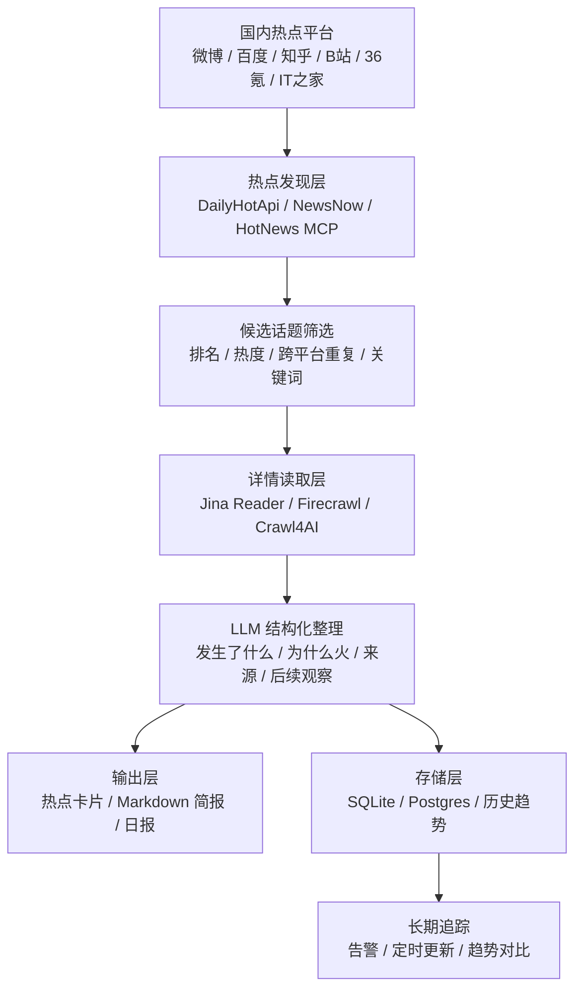
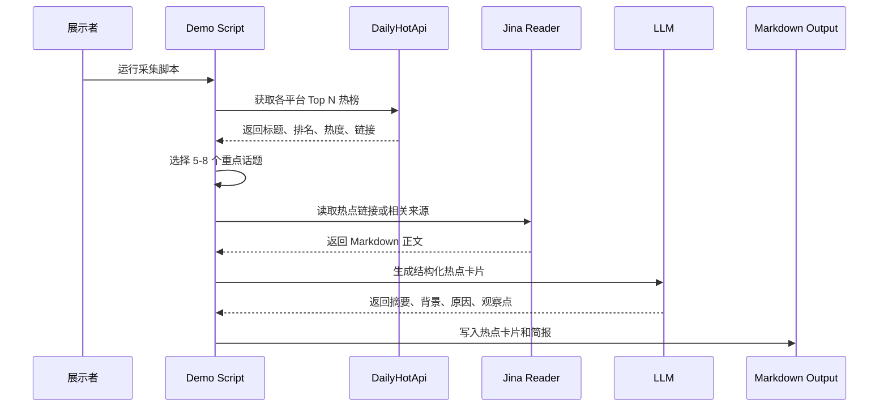
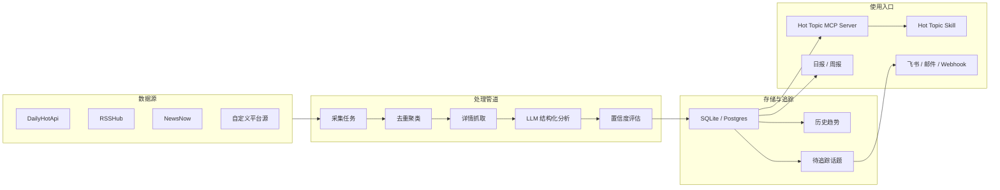
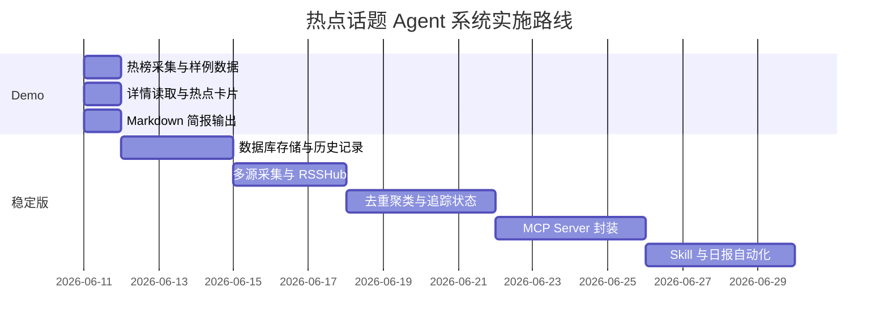

# 国内热点话题 Agent 系统调研与实施建议汇报

> 日期：2026-06-11  
> 主题：基于 Skills、Agents、MCP 与热榜工具构建国内热点话题收集与详情整理系统  
> 目标：形成可展示的 Demo 方案，并给出长期稳定版建设路径。

## 1. 核心结论

目前市场上已经有不少 Skills、Agents、MCP Server、工作流平台和网页抓取工具，但它们大多只覆盖系统的一部分能力。对于“国内热点话题收集与详情整理”这个目标，最合理的方案不是寻找单一万能 Agent，而是采用组合架构：

```text
热点发现工具
+ 详情读取工具
+ LLM 结构化整理
+ 定时任务
+ 历史存储
+ Skill / MCP 封装
```

短期 Demo 应优先保证可跑通、可展示、低风险；长期稳定版再补足多源采集、去重聚类、历史追踪、告警和自动日报。

推荐最终方案：

```text
Demo 版：
DailyHotApi + Jina Reader + LLM + Markdown 简报

长期稳定版：
DailyHotApi + RSSHub + Jina Reader/Firecrawl/Crawl4AI
+ 数据库存储
+ 定时任务
+ 自建 MCP Server
+ 自定义 Hot Topic Skill
+ Agent 编排
```

## 2. 市场技术栈调研

本项目相关技术栈可以按“热点数据源、详情读取、Agent 编排、能力封装、自动化调度”来调研。这里不展开解释每类技术的概念，只看它们在本项目中的作用和局限性。

### 2.1 热点发现与内容源

| 技术栈 / 工具 | 作用 | 局限性 |
|---|---|---|
| [DailyHotApi](https://github.com/imsyy/DailyHotApi) | 聚合国内多个平台热榜，支持 JSON/RSS，适合作为 Demo 版主数据源 | 主要返回标题、排名、热度、链接；不负责事件背景和深度详情；部分平台接口可能因反爬或页面变化失效 |
| [OpenClaw 每日热榜 Skill](https://github.com/one-box-u/openclaw-daily-hot-news) | 将 DailyHotApi 能力封装成 Skill，可展示“现成热点 Skill”形态 | 本质仍是热榜查询层；第三方 Skill 长期可控性和安全性不如自建 |
| [NewsNow](https://github.com/ourongxing/newsnow) | 提供实时热点新闻阅读界面，可作为展示看板或补充热点源 | 偏阅读产品，不是完整的热点分析管道；详情卡片仍需 LLM 生成 |
| [NewsNow MCP Server](https://github.com/ourongxing/newsnow-mcp-server) | 将 NewsNow 热点源开放给 Agent 调用，适合问答式 Demo | 更适合“查询当前热点”，不负责跨平台聚类、历史追踪和深度整理 |
| [HotNews MCP Server](https://github.com/wopal-cn/mcp-hotnews-server) | 面向中国主流平台返回实时热点列表，适合展示 Agent 工具调用 | 覆盖平台和返回字段有限，更多是列表能力，不是完整情报系统 |
| [RSSHub](https://github.com/DIYgod/RSSHub) | 长期订阅新闻、科技、社区、博客、论坛等稳定信息源，补充热榜之外的背景材料 | 不是热搜系统，不能单独承担“发现当前最热话题”；部分路由依赖目标站点结构和访问限制 |

判断：热点发现层首选 DailyHotApi；RSSHub 适合长期版补充稳定信息流；NewsNow/HotNews MCP 更适合演示 Agent 查询能力。

### 2.2 详情读取与网页抓取

| 技术栈 / 工具 | 作用 | 局限性 |
|---|---|---|
| [Jina Reader](https://jina.ai/reader/) | 将 URL 转成 LLM 可读 Markdown，适合快速读取新闻页、文章页、博客页 | 对登录态、强反爬、复杂动态页面不稳定；不能保证每个国内平台详情页都能读到 |
| [Jina Search / Reader GitHub](https://github.com/jina-ai/reader) | 可用标题搜索相关网页，再读取更适合摘要的页面 | 搜索结果质量受查询词影响，需要做来源筛选和置信度标记 |
| [Firecrawl](https://www.firecrawl.dev/) | 抓取网页并输出 Markdown、HTML、截图、结构化数据，适合复杂页面和长期版增强 | 接入、成本、限额和 API Key 管理比 Jina Reader 更重 |
| [Crawl4AI](https://docs.crawl4ai.com/) | 开源 LLM-friendly 爬虫，可自建抓取、过滤、缓存、动态页面处理流程 | 需要维护爬虫环境、浏览器依赖、代理和反爬策略；不适合明早 Demo 优先使用 |

判断：Demo 版用 Jina Reader 足够；长期稳定版需要 Firecrawl 或 Crawl4AI 作为兜底，避免详情读取能力过于依赖单一服务。

### 2.3 Agent 编排与工作流平台

| 技术栈 / 工具 | 作用 | 局限性 |
|---|---|---|
| [OpenAI Agents SDK](https://developers.openai.com/api/docs/guides/agents) | 编排“采集热榜、筛选话题、读取详情、生成卡片、写入结果”的多步流程 | 需要代码开发；Demo 阶段引入会增加工程量 |
| [LangGraph](https://docs.langchain.com/oss/python/langgraph/overview) | 适合长期任务、状态持久化、多步骤流程和人工确认节点 | 学习成本和结构设计成本较高；简单 Demo 不需要 |
| [CrewAI](https://docs.crewai.com/) | 用多个角色 Agent 分工分析，例如采集员、分析员、审稿员 | 本项目核心不是多 Agent 协作，强行使用会让系统复杂化 |
| [Dify](https://dify.ai/) | 快速搭建可视化 Agentic Workflow、RAG、工具调用和后台应用 | 平台绑定较明显，复杂定制和底层控制不如代码方案 |
| [Coze](https://www.coze.com/open/docs/guides) | 快速构建 Agent、workflow、plugin，适合演示型应用 | 适合产品原型，不适合作为完全可控的长期核心管道 |
| [n8n](https://docs.n8n.io/integrations/builtin/cluster-nodes/root-nodes/n8n-nodes-langchain.agent/) | 做定时任务、API 编排、飞书/邮件/Webhook 推送 | 适合调度和通知，不负责热点理解；核心分析仍要依赖 LLM 和抓取工具 |

判断：Demo 阶段不需要复杂 Agent 框架；长期版优先考虑 OpenAI Agents SDK 或 LangGraph，n8n 可作为调度和通知层。

### 2.4 Skill 与 MCP 封装

| 技术栈 / 工具 | 作用 | 局限性 |
|---|---|---|
| [Claude Agent Skills](https://platform.claude.com/docs/en/agents-and-tools/agent-skills/overview) | 把热点分析流程、输出模板、脚本封装成可复用 Skill | Skill 本身不提供数据源，需要依赖自建 API、MCP 或外部服务 |
| [Anthropic Skills Repository](https://github.com/anthropics/skills) | 提供 Skill 目录结构和示例，可参考其组织方式 | 示例偏通用任务，不是国内热点场景专用 |
| 自建 `Hot Topic Skill` | 固化“热点筛选、详情补全、卡片生成、日报输出”的方法 | 需要先有稳定底层能力，否则 Skill 只是包装层 |
| 自建 `Hot Topic MCP Server` | 暴露 `get_hot_list`、`read_topic_detail`、`search_related_sources`、`get_topic_history`、`generate_daily_digest` 等工具 | 需要开发、部署和维护；还要处理鉴权、限流、错误重试和数据存储 |

判断：Skill 和 MCP 应作为长期版能力封装层，不应作为 Demo 阶段的核心依赖。先跑通数据链路，再封装成 Skill/MCP。

### 2.5 市场调研结论

| 能力需求 | 市场上已有能力 | 缺口 |
|---|---|---|
| 获取国内热榜 | DailyHotApi、OpenClaw Skill、NewsNow、HotNews MCP | 多数只提供热榜列表，不提供可靠详情 |
| 读取详情正文 | Jina Reader、Firecrawl、Crawl4AI | 国内动态页面、登录页面、反爬页面仍不稳定 |
| 生成热点卡片 | LLM + Prompt/Skill 可以完成 | 需要来源约束和置信度标记，否则容易出现幻觉 |
| 定时更新 | cron、n8n、Dify workflow 可以完成 | 需要失败重试、状态记录和历史去重 |
| 长期追踪 | 数据库 + Agent 编排可实现 | 市场上没有直接面向“国内热点追踪”的完整现成系统 |

最终判断：现有技术栈可以覆盖各个局部能力，但没有一个工具能直接完成“国内热点发现 + 详情补全 + 跨平台合并 + 历史追踪 + 日报生成”。因此本项目应采用组合式方案。

## 3. 方案总览图



## 4. 实施建议

### 4.1 Demo 版方案

Demo 版目标不是完整系统，而是明确定义一条最短可展示链路：

```text
获取热榜
→ 选择重点话题
→ 读取详情
→ 生成热点详情卡
→ 输出当前热点简报
```

推荐技术组合：

| 模块 | 选择 | 理由 |
|---|---|---|
| 热榜入口 | DailyHotApi | 覆盖国内平台多，JSON/RSS 接入简单 |
| 详情读取 | Jina Reader | URL 转 Markdown，适合快速接入 LLM |
| 内容整理 | LLM | 生成背景、原因、主体、后续观察点 |
| 输出形式 | Markdown | 最快可展示，也方便转 PDF/网页 |
| 数据保存 | JSON 文件 | Demo 阶段足够，避免数据库复杂度 |

Demo 版推荐平台：

```text
微博：大众舆论热点
百度：全网搜索热点
知乎：讨论型热点
B站：视频和年轻群体热点
36氪：商业科技热点
IT之家：科技数码热点
```

Demo 版输出文件：

```text
hot_list.json
hot_topic_cards.md
daily_digest_demo.md
```

Demo 版数据流：



Demo 版交付标准：

1. 至少采集 4 个国内平台。
2. 至少生成 5 条热点详情卡。
3. 每条卡片必须包含“发生了什么、为什么火、来源平台、排名热度、是否继续跟踪”。
4. 有兜底逻辑：详情页读取失败时，用标题搜索相关新闻或只基于热榜信息生成低置信度卡片。

### 4.2 长期稳定版方案

长期稳定版的目标是从“能展示”升级为“能持续运行、能追踪、能沉淀数据”。

推荐技术组合：

| 模块 | 选择 | 理由 |
|---|---|---|
| 热榜采集 | DailyHotApi + NewsNow + 自定义源 | 提高覆盖面和抗单点失败能力 |
| 稳定订阅 | RSSHub | 补充新闻、科技、论坛、博客等长期来源 |
| 详情读取 | Jina Reader + Firecrawl/Crawl4AI | 兼顾轻量接入和复杂页面抓取 |
| 调度 | cron / n8n / 后端任务队列 | 每 1-3 小时自动运行 |
| 存储 | SQLite 起步，后期 Postgres | 支持历史趋势、去重、追踪状态 |
| Agent 编排 | OpenAI Agents SDK 或 LangGraph | 管理多步流程、工具调用、异常分支 |
| 工具接口 | 自建 MCP Server | 让不同 Agent 客户端都能调用热点能力 |
| 能力封装 | 自定义 Hot Topic Skill | 固化热点分析流程和输出模板 |

长期稳定版架构：



长期版核心能力：

1. **多源采集**：不仅取热榜，也取新闻、科技、论坛、RSS。
2. **跨平台合并**：同一事件在微博、百度、知乎出现时合并为一个话题。
3. **详情补全**：优先抓可读性强的新闻页，弱化难抓平台详情页。
4. **历史追踪**：记录话题首次出现、最高排名、持续时间、平台扩散路径。
5. **自动日报**：每天固定时间生成热点简报。
6. **告警机制**：当关键词、平台排名或热度达到阈值时推送。
7. **工具化封装**：通过 MCP Server 和 Skill 让 Agent 随时查询热点状态。

## 5. Demo 版与长期稳定版对比

| 维度 | Demo 版 | 长期稳定版 |
|---|---|---|
| 目标 | 明早能展示完整链路 | 稳定运行、持续跟踪 |
| 数据源 | DailyHotApi 为主 | DailyHotApi + RSSHub + NewsNow + 自定义源 |
| 详情读取 | Jina Reader | Jina Reader + Firecrawl/Crawl4AI |
| 存储 | JSON/Markdown 文件 | SQLite/Postgres |
| 调度 | 手动运行或简单定时 | cron/n8n/任务队列 |
| Agent 复杂度 | 低，脚本 + LLM 即可 | 中高，Agent SDK/LangGraph 编排 |
| 输出 | 热点卡片、当前简报 | 日报、周报、趋势、告警 |
| 风险控制 | 少平台、少依赖、可兜底 | 多源冗余、失败重试、监控 |

## 6. 风险与规避

| 风险 | 表现 | 规避方式 |
|---|---|---|
| 国内平台反爬 | 页面抓不到、需要登录、内容为空 | Demo 阶段优先用聚合 API 和新闻页，不强抓难平台 |
| 热榜只有标题 | 无法生成具体背景 | 使用 Jina Reader 或搜索补充来源 |
| 第三方 Skill 不稳定 | 安装失败、接口变化 | Skill 只作参考，核心链路自建 |
| 多 Agent 复杂度过高 | 开发慢、调试难 | 先用单流程管道，后期再引入 Agent 编排 |
| 结果幻觉 | LLM 补充不存在的信息 | 要求引用来源，设置置信度，保留低置信度标记 |

## 7. 推荐实施路线



## 8. 最终建议

最终选择：

```text
Demo 版：
DailyHotApi + Jina Reader + LLM + Markdown

长期稳定版：
DailyHotApi + RSSHub + Jina Reader + Firecrawl/Crawl4AI
+ SQLite/Postgres
+ cron/n8n
+ OpenAI Agents SDK 或 LangGraph
+ 自建 Hot Topic MCP Server
+ 自定义 Hot Topic Skill
```

不建议优先做：

1. 不要一开始强接小红书、抖音、快手详情页。
2. 不要为了展示 Agent 而堆多 Agent。
3. 不要只输出热搜标题。
4. 不要长期依赖第三方 Skill 作为核心能力。

真正应该优先保证的是：稳定拿到热点、能补充详情、能生成可信的热点卡片。

## 9. 参考来源

- [Anthropic Claude Agent Skills](https://platform.claude.com/docs/en/agents-and-tools/agent-skills/overview)
- [OpenAI Agents SDK](https://developers.openai.com/api/docs/guides/agents)
- [OpenAI Tools](https://developers.openai.com/api/docs/guides/tools)
- [Model Context Protocol Specification](https://modelcontextprotocol.io/specification/2025-06-18)
- [DailyHotApi](https://github.com/imsyy/DailyHotApi)
- [OpenClaw Daily Hot News Skill](https://github.com/one-box-u/openclaw-daily-hot-news)
- [NewsNow](https://github.com/ourongxing/newsnow)
- [NewsNow MCP Server](https://github.com/ourongxing/newsnow-mcp-server)
- [HotNews MCP Server](https://github.com/wopal-cn/mcp-hotnews-server)
- [RSSHub](https://github.com/DIYgod/RSSHub)
- [Jina Reader](https://jina.ai/reader/)
- [Firecrawl](https://www.firecrawl.dev/)
- [Crawl4AI](https://github.com/unclecode/crawl4ai)
- [LangGraph](https://www.langchain.com/langgraph)
- [CrewAI Docs](https://docs.crewai.com/)
- [Dify](https://dify.ai/)
- [Coze Docs](https://www.coze.com/open/docs/guides)
- [n8n AI Agent Docs](https://docs.n8n.io/integrations/builtin/cluster-nodes/root-nodes/n8n-nodes-langchain.agent/)
